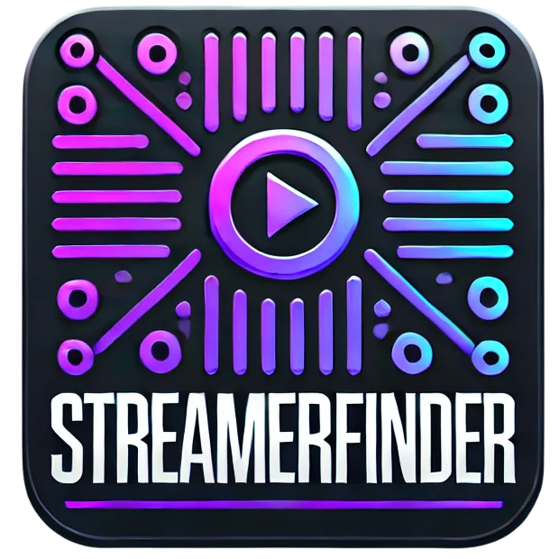

<div align="center"></div>

# Streamer Finder

Este proyecto es una aplicación desarrollada en Python que utiliza Streamlit para crear una interfaz web interactiva. Su objetivo es recomendar streamers a los usuarios en función de ciertos criterios o preferencias.

## Estructura del Proyecto

El repositorio contiene los siguientes directorios y archivos principales:

- `.devcontainer/`: Configuraciones para entornos de desarrollo en contenedores.
- `.github/`: Archivos de configuración para GitHub Actions u otras integraciones.
- `.streamlit/`: Configuraciones específicas de Streamlit, como temas o parámetros de ejecución.
- `datos/`: Directorio destinado a almacenar conjuntos de datos utilizados por la aplicación.
- `imagenes/`: Imágenes utilizadas en la aplicación o en la documentación.
- `pages/`: Páginas adicionales de la aplicación Streamlit, si las hubiera.
- `src/`: Código fuente principal de la aplicación.
- `.gitignore`: Especifica los archivos y directorios que Git debe ignorar.
- `LICENSE`: Archivo de licencia del proyecto.
- `README.md`: Archivo que contiene información y documentación del proyecto.
- `requirements.txt`: Lista de dependencias de Python necesarias para ejecutar la aplicación.
- `streamlit_app.py`: Archivo principal de la aplicación Streamlit.

## Requisitos Previos

Antes de ejecutar la aplicación, asegúrate de tener instalado lo siguiente:

- **Python 3.7 o superior**: Puedes descargar la última versión desde [python.org](https://www.python.org/).
- **pip**: El gestor de paquetes de Python, que generalmente viene incluido con Python.

## Instalación y Ejecución

Sigue estos pasos para instalar y ejecutar la aplicación en tu máquina local:

1. **Clonar el repositorio**:

   Abre una terminal y ejecuta:

   ```bash
   git clone https://github.com/Ivan-BV/recomendador-streamers.git
   cd recomendador-streamers
   ```

2. Crear un entorno virtual (opcional pero recomendado):

   Es una buena práctica utilizar entornos virtuales para gestionar las dependencias.

   ```bash
   python3 -m venv venv
   source venv/bin/activate  # En Windows, usa venv\Scripts\activate
   ```

3. Instalar las dependencias:

   Ejecuta:

   ```bash
   pip install -r requirements.txt
   ```

4. Ejecutar la aplicación:

   Inicia la aplicación Streamlit con:

   ```bash
   streamlit run streamlit_app.py
   ```

   Esto abrirá una nueva pestaña en tu navegador predeterminado con la interfaz de la aplicación.

## Uso de la Aplicación

Una vez que la aplicación esté en funcionamiento, podrás interactuar con ella a través de la interfaz web. Aunque los detalles específicos de la funcionalidad no se proporcionan en el repositorio, generalmente, una aplicación de recomendación te permitirá:

Ingresar tus preferencias o criterios de búsqueda.
Recibir una lista de streamers recomendados en función de tus entradas.
Explora la aplicación para familiarizarte con sus características y opciones.

## Contribuciones

Si deseas contribuir al proyecto, puedes hacerlo de la siguiente manera:

1. Fork del repositorio:

   Haz un fork del proyecto en tu cuenta de GitHub.

2. Crear una rama:

   Crea una nueva rama para tu característica o corrección:

   ```bash
   git checkout -b nombre-de-tu-rama
   ```

3. Realizar cambios:

   Realiza tus modificaciones y asegúrate de que el código funcione correctamente.

4. Confirmar cambios:

   Confirma tus cambios con un mensaje descriptivo:

   ```bash
   git commit -m "Descripción de tus cambios"
   ```

5. Enviar cambios:

   Envía tus cambios a tu repositorio forked:

   ```bash
   git push origin nombre-de-tu-rama
   ```

6. Crear una Pull Request:

   Desde tu repositorio en GitHub, abre una Pull Request hacia el repositorio original.

## Licencia

Este proyecto está bajo la Licencia Apache 2.0. Consulta el archivo [LICENSE](https://github.com/Ivan-BV/recomendador-streamers/blob/main/LICENSE) para más detalles.

Espero que esta guía te sea de ayuda para comprender y utilizar el proyecto Recomendador de Streamers. Si tienes alguna pregunta o necesitas asistencia adicional, no dudes en consultar la documentación o abrir un issue en el repositorio.
